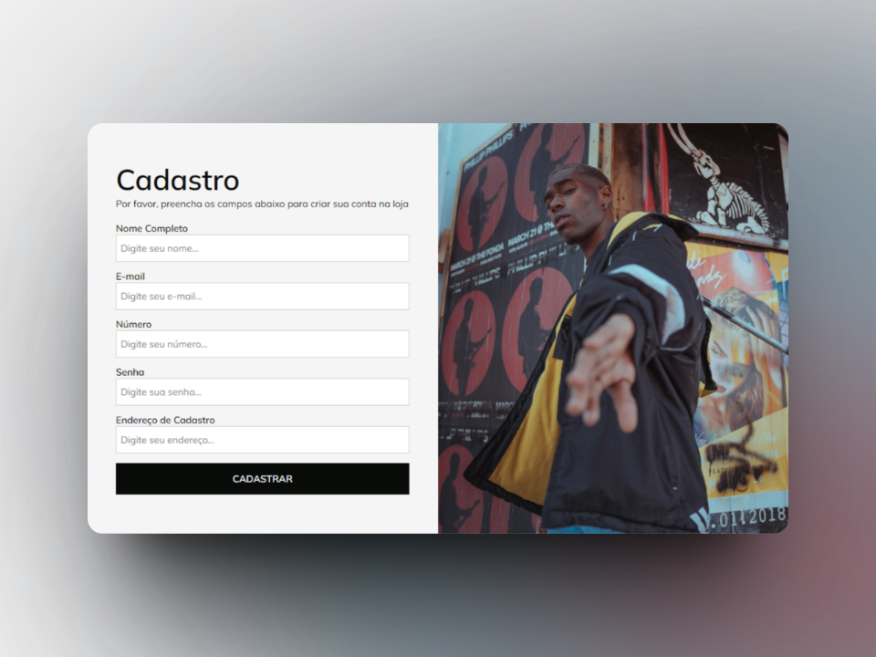

<h1 align="center">Store Form Validation</h1>

- [Descrição do Projeto](#descrição-do-projeto)
- [Tecnologias](#tecnologias-utilizadas)
- [Layout](#layout)
  - [Web](#web)

<h2>Descrição do projeto</h2>

  Projeto desenvolvido com o objetivo de praticar validação e armazenamento de entrada de dados do usuário.

<h2>Tecnologias utilizadas</h2>

- HTML
- CSS
- JavaScript

<h2>Layout</h2>

<h3>Web</h3>

